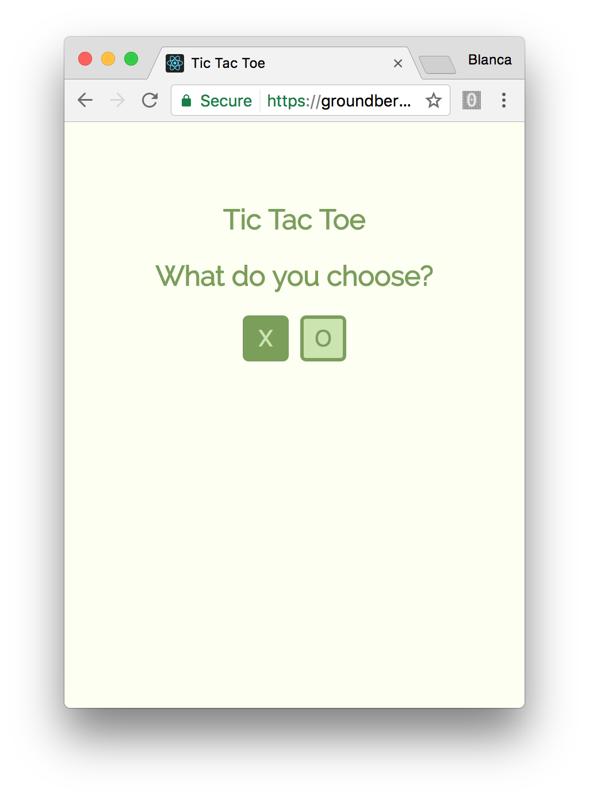
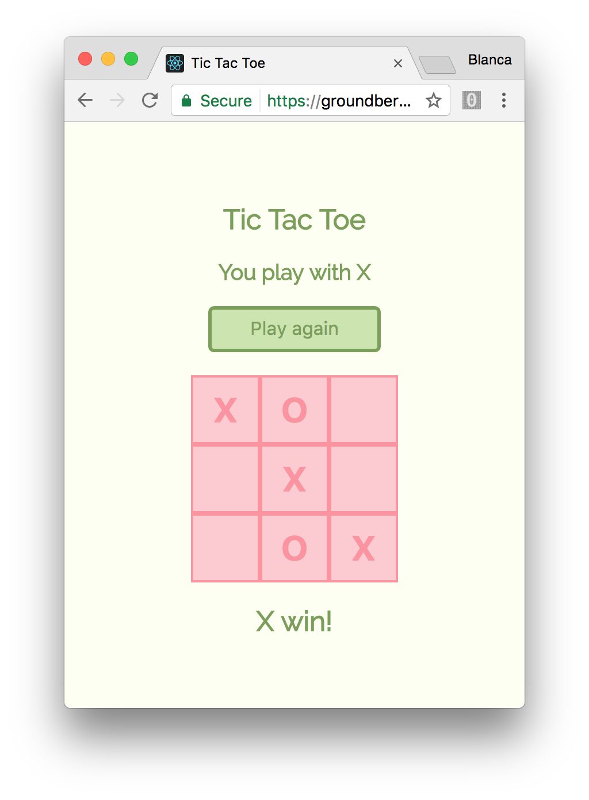

# Tic Tac Toe

This project is part of the Free Code Camp's front-end track. I'll build a Tic Tac Toe game using [React](https://facebook.github.io/react/). As it's a [PWA](https://en.wikipedia.org/wiki/Progressive_web_app) (Progressive Web App), you can add it to the Home screen on your smartphone and play the game wherever you are! To do that you just need to open the link on your browser when you are using your phone and select the "Add to Home screen" option from the top right dropdown menu.

## Functionality

- I can play a game of Tic Tac Toe with the computer.
- My game will reset as soon as it's over so I can play again.
- I can choose whether I want to play as X or O.




## Technologies used

This app is built with [React](https://facebook.github.io/react/). I used [Create React App](https://github.com/facebookincubator/create-react-app) to get it started.

For testing I used [Jest](https://github.com/facebook/jest).

## Running

Clone this repo:

```
$ git clone https://github.com/groundberry/react-tic-tac-toe
```

Install all dependancies:

```
$ npm install
```

Start the server:

```
$ npm start
```

## Testing

Run the tests:

```
$ npm run test
```

